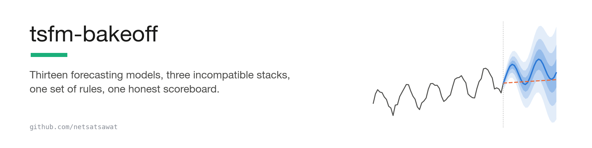

<h1 align="center">
  <picture>
    <source media="(prefers-color-scheme: dark)" srcset="assets/banner-dark.png">
    
  </picture>
</h1>

<p align="center">
  <a href="#-headline-results">Headline results</a>&nbsp;&nbsp;·&nbsp;&nbsp;<a href="#read-these-caveats-before-quoting-the-numbers">Caveats</a>&nbsp;&nbsp;·&nbsp;&nbsp;<a href="#-experimental-protocol">Protocol</a>&nbsp;&nbsp;·&nbsp;&nbsp;<a href="#-quick-start">Quick start</a>
</p>

<p align="center">
  <a href="LICENSE"></a>
  <a href="https://www.python.org/"></a>
  
  
  
  <a href="https://satsawat.ai"></a>
</p>

This repository tests 13 forecasting methods on ten data series (nine real, one
synthetic control, which is a made-up series with no pattern used as a sanity check) and
reports which method wins at 1, 7, 14 and 30 days ahead. Five of
the methods are "foundation" models: models someone else already trained on huge piles
of other data, so you download one and forecast with no training step of your own. The
other eight are the plain baselines a foundation model has to beat before it is worth
adopting. It needs no API keys and no GPU.

Foundation models beat the baselines on data with a repeating daily or weekly pattern
(seasonal data, in forecasting terms), as other studies have already shown. This study
measures **which one wins, and at how many days ahead**. The winner changes depending on
how many days ahead you forecast. A single leaderboard rank (a public ranking of models)
hides that, because it reports one number per model.

The pitch is genuinely attractive. A foundation model is something you call the way you
call a large language model (an LLM, the kind of model behind a chat assistant): you hand
it the recent history of any series and get a forecast back, with no training step of
your own. Classical forecasting works the other way. The older statistical methods have
to be fitted to each series first, meaning their settings are estimated from that one
series before they can forecast it. That fitting step is where classical forecasting
projects go to die. But the pitch arrives with leaderboards, and I wanted to know what
survives contact with data the models have never seen, against baselines configured in
good faith. Making
thirteen models comparable took most of the work in this repository. Each model group
runs in its own Python environment and hands its forecasts to the next on disk (the why
is under [Why three environments](#-why-three-environments)).

Every headline number in this README is recomputed from the results file kept in the
repository, `results/cross_env_scores.json`, by `scripts/verify_readme_claims.py`. That
covers the protocol counts, the two win tables, Toto's rank, TimesFM's missing cells (one
cell is one dataset forecast at one horizon) and the Bangkok PM2.5 table (PM2.5 is fine
airborne dust, an air-quality reading). A GitHub job (CI) runs that script on every change
pushed to the repository. The other numbers in this README name the file they come
from. You can run the script yourself before reading further.

Companion code for the writing at [satsawat.ai](https://satsawat.ai).

## Terms used below

| term | plain meaning |
|---|---|
| foundation model | A forecasting model that was pretrained on huge amounts of other people's data. You hand it the recent history of your series and get a forecast back, with no training step. The five here are TimesFM 2.5, Chronos-2, Chronos-Bolt, Toto and Moirai-2. All five ran zero-shot: used exactly as downloaded, with no extra training on these ten series (no fine-tuning). |
| baseline | A method a foundation model has to beat. Four are one-line naive rules (repeat the last value, repeat the mean, repeat last season, repeat the median shape of past seasons). Three are classical statistical models fitted fresh on each series, meaning their parameters are estimated from that series' own history before forecasting (AutoETS, AutoTheta and MSTL, from the `statsforecast` library). One is a gradient-boosted tree model, many small decision trees added together (GBDT for short), fed calendar features such as day of week and position in the daily cycle (`gbdt_calendar`). GBDT is the kind of model many teams already run. |
| horizon | How far ahead the forecast reaches. Horizons are set in days and converted to steps per series, so a 1-day horizon is 24 hourly steps or 48 half-hourly steps. |
| origin | A point in time where a model is stopped and asked to forecast the next horizon. One forecast proves nothing, so every model forecasts from 16 evenly spaced origins per series (rolling origins) and the errors are averaged. |
| MASE | Mean absolute scaled error, the score that picks winners. Take the model's average error. Divide it by the error of a simple "repeat last season" guess, measured on the same past data the model saw. A MASE of 1.0 means the model did no better than that guess. Lower is better. |
| cell | One dataset paired with one horizon. Every model forecasts that same task from the same origins, and the lowest MASE wins the cell. There are 38 cells. |
| the artifact | `results/cross_env_scores.json`, the scored results file kept in the repository. Every headline number comes from it. A second set of files, `results/bakeoff_full2*`, holds an earlier run over the same ten datasets at one horizon each, without Toto and Moirai-2. When this README says "the artifact" it means the first file. |

---

## 🚀 Quick start

Two ways in. The first needs nothing but Python and downloads nothing. The second
rebuilds the study from scratch, needs about 10 GB of disk, and downloads the weights
of five models (their checkpoints) from Hugging Face, the public model hosting site.

### Path one: check the numbers

```bash
git clone https://github.com/netsatsawat/tsfm-bakeoff && cd tsfm-bakeoff
python3 scripts/verify_readme_claims.py
```

`scripts/verify_readme_claims.py` reads the artifact and recomputes every headline
number. It uses the standard library only, and it runs on Python 3.9 as well as 3.12.
CI runs the same script on every push (`.github/workflows/ci.yml`, Python 3.10) and
fails if this README and the artifact disagree.

You should see this, with one `ok` line per check:

```
protocol, recomputed from results/cross_env_scores.json:
  ok  family map covers exactly the models in the artifact
  ok  every cell was scored at one origin count
  ok  README headline states 38 cells, 10 datasets, horizons of 1, 7, 14 and 30 days, 13 models
  ...
cells won per family:
  ok  README family table: **Foundation** 30
  ...
Bangkok PM2.5, best foundation vs best naive:
  ok  README horizon table: 1-day | 0.647 | **0.589** | naive_last
  ...

every quoted README number matches its artifact
```

Then open **`timesfm_quickstart.ipynb`**. The notebook is already executed, so you can
read it without installing anything. It walks TimesFM 2.5, Chronos-2, AutoETS and two
naive baselines through one series, UK half-hourly electricity demand. Its last cell
repeats the comparison at 1 and 7 days. In the executed output TimesFM
wins both, and its lead over Chronos-2 shrinks from 0.13 MASE at 1 day to 0.01 at 7
days. That cell is the cheapest way to see how much the horizon moves the numbers.

### Path two: rebuild the study

You need Python 3.10 or newer. If your system Python is older, install `uv` (a Python
installer and package tool) and `envs/setup.sh` will use it to fetch a newer Python. The
reason is that the core environment (TimesFM, Chronos-2, Chronos-Bolt, the classical
models, GBDT and the naive rules) pins numpy 2.2.6 (locks it to that exact version), and
that version needs Python 3.10 or newer. `envs/setup.sh` checks for one of the two and stops early if neither holds.

```bash
bash envs/setup.sh                        # builds .venv-core, .venv-toto, .venv-moirai; budget ~10 GB
.venv-core/bin/python datasets.py         # fetches the ten series from live APIs into data/; no API keys

.venv-core/bin/python   runners/run_core.py   --datasets bangkok_pm25_1h   # TimesFM, Chronos-2, Chronos-Bolt, classical, GBDT, naive
.venv-toto/bin/python   runners/run_toto.py   --datasets bangkok_pm25_1h   # Toto (Toto-Open-Base-1.0)
.venv-moirai/bin/python runners/run_moirai.py --datasets bangkok_pm25_1h   # Moirai-2

python3 score.py --datasets bangkok_pm25_1h   # stdlib only; no virtualenv needed
```

Run `run_core.py` **first**. It writes the truth file: the real future values for every
origin, plus the number each model's error is divided by to get its MASE. The other two
runners and the scorer depend on that file.

`run_core.py` prints one header line per dataset, for example
`bangkok_pm25_1h: n=... horizon=24 season=24 context=... origins=16`, where `context`
is how many past steps each model gets to see. Then it prints one line per model marked
`ok`, `SKIP` or `FAIL`. `run_toto.py` and `run_moirai.py` print a shorter header,
`bangkok_pm25_1h: 16 origins, horizon 24, context 1536`, followed by `toto_2p0 ok` or
`moirai_2 ok`. When one of those two fails you get a raw Python traceback, not a `FAIL`
line. `score.py` prints one table per dataset, sorted by MASE, with the columns
`model`, `MASE`, `WQL` (a score for the forecast's spread of possible values, defined
under Metric definitions), `cov80` (how often the true value fell inside the model's
80% band), `n` (origins scored) and `env` (which environment produced the forecast). It
then writes the artifact. `results/matrix.log` is the log of the first full pass over
all 38 cells. One Toto cell was re-run afterwards (see the caveats), so that log lacks
that one Toto row.

Three things the commands above do not say on their own:

- `data/` and `forecasts/` are not committed (see `.gitignore`). On a fresh clone,
  `python3 score.py` fails with a `FileNotFoundError` until a runner has written
  forecasts. Run the runners first.
- With no `--datasets` flag, `run_core.py` and `run_toto.py` default to two datasets
  (`bangkok_pm25_1h` and `boom_telemetry_5t`, BOOM for short, a server-monitoring
  dataset from Datadog that holds 14 days per series) and `run_moirai.py` to one
  (`bangkok_pm25_1h`). Each
  runs at its native horizon only. The native horizon is the one used when you pass no
  `--horizon-days`, one day for most datasets. The bare defaults are a smoke test, a
  quick run that shows the pipeline works.
- The 38-cell headline comes from `bash run_matrix.sh`. It loops all ten datasets over
  the four horizons, calls the three runners per cell, skips two cells for BOOM (14
  days per series, so 14- and 30-day forecasts are impossible), and scores the lot into
  the artifact.

Useful flags:

```bash
--datasets bangkok_pm25_1h btc_returns_1h   # which series; all three runners take this flag
--origins 16          # run_core.py: rolling origins per cell (default 16)
--context 2048        # run_core.py: history steps a model may see before each origin, clamped per dataset
--horizon-days 7      # run_core.py: overrides the native horizon; converted per frequency
--samples 256         # run_toto.py and run_moirai.py: random forecast draws (sample paths) per forecast (defaults 256 and 100)
--device cpu          # run_moirai.py: cpu, mps (Apple GPU) or cuda (NVIDIA GPU); default cpu
```

`datasets.py` takes `--keys` instead of `--datasets`, plus `--refresh` to refetch.
`prepare.py` takes the same two flags. Running it is optional: it prints the data checks
for each series (regular grid, gaps, duplicates and so on). The runners call the same
checks themselves before every forecast.

Refetchers should know that the NESO, Open-Meteo, USGS and Binance sources are live
APIs, and the BOOM download is not pinned to a dataset revision. A fresh `datasets.py`
run reproduces the study's series only as those sources allow. The committed results
were produced from the cache as fetched for this study.

---

## 🏁 Headline results

> **Terminology.** One **cell** = one dataset paired with one horizon: all 13 models
> forecasting the same series, from the same origins, over the same distance. Lowest
> MASE takes it. (TimesFM is missing from two of the 38 cells. The caveats below say
> which and why.) The blog posts at satsawat.ai call these *contests*, a plainer word
> for the same thing. The code and this README say `cell` because that is what the
> variables are called.

38 dataset x horizon cells: 10 datasets, horizons of 1, 7, 14 and 30 days, 13 models,
16 rolling origins each. Lowest MASE per cell wins.

Cells won by method group (the table calls the group a family), out of 38. The four
rows sum to 38:

| family | cells won |
|---|---|
| **Foundation** | **30** |
| Naive | 5 |
| Classical | 2 |
| ML (GBDT) | 1 |

Cells won by each foundation model, again out of 38. TimesFM's count is out of 36,
because it could not run two of the cells. In the table below, Chronos-2 is shown in bold
because it won the most cells, and Toto is in bold because it has its own section further
down:

| model | cells won |
|---|---|
| Chronos-2 | **13** |
| TimesFM 2.5 | 6 |
| Moirai-2 | 6 |
| Chronos-Bolt | 5 |
| **Toto (Toto-Open-Base-1.0)** | **0** |

Pretrained models won about four cells in five. A one-line naive rule still won five.
The winner also changes with the horizon on the same data. If you are choosing a model,
the horizon effect is the finding that matters most. Three results are worth sitting
with.

### The classical workhorse won nothing

**AutoETS won nothing.** Neither did the seasonal naive. (AutoETS is the classical
workhorse, a statistical model fitted to each series. The seasonal naive repeats last
season's values.) If you are benchmarking a foundation model against AutoETS to decide
whether to adopt one, this study already says yes: AutoETS lost every cell.

### Toto, the open version of a leaderboard-topping model, won nothing either

A naming correction first, because an earlier draft of this study got it wrong. The
checkpoint benchmarked here is **Toto-Open-Base-1.0**, Datadog's openly released
model. It is not the newer Toto-2.0 family that currently tops GIFT-Eval, a public
leaderboard of time-series models. In the artifact this model is labelled `toto_2p0`.
That label is wrong (it came from the version number of the `toto-ts` package, 0.2.0)
and is kept so the file stays consistent with itself.

That checkpoint ran all 38 cells with a mean rank of 9.8 out of 13 (best 4, worst 13) and won none.
The mean rank is Toto's position in each cell's MASE ranking, averaged over the 38
cells. Toto usually landed in the bottom third. That includes the BOOM cells, where it
should be strongest, because BOOM is Datadog's own benchmark and Toto trains on
Datadog's server-monitoring data (telemetry). Part of this study is home turf for it.

The honest conclusion has two parts. A newer Toto tops a public leaderboard, and that
tells you nothing about how this older, open Toto does on your data at your horizon.
Rank on one benchmark does not predict rank on another. Measure your own series.
Rerunning with the Toto-2.0 weights is queued as future work.

### The horizon changes the winner on the same data

Bangkok PM2.5, hourly air quality. Values are MASE, so lower is better and 1.0 means
no better than a repeat-last-season guess. Bold marks the row's winner:

| horizon | best foundation | best naive | winner |
|---|---|---|---|
| 1-day | 0.647 | **0.589** | naive_last |
| 7-day | **0.833** | 0.964 | Moirai-2 |
| 14-day | **0.962** | 1.098 | Moirai-2 |
| 30-day | **1.060** | 1.100 | Moirai-2 |

At one day ahead, repeating the last value beats every pretrained model. From seven
days out, Moirai-2 wins. A benchmark that tests one horizon catches one row of this
table and calls it the model's ranking. The crossover for this series sits somewhere
between day 1 and day 7. This study does not localize it further.

### Read these caveats before quoting the numbers

- 16 origins per cell. Enough to rank, not enough to separate models within a few
  percent. Treat any gap under ~5% as a tie. That threshold is my rule of thumb for
  this sample size. It is not a computed range of uncertainty.
- Long horizons crowd the short series. Four hourly series (both temperatures, PM2.5
  and white noise, which is random values with no pattern) cover 2026-03-01 to
  2026-07-07: 129 days, or 3,096 points. With 129 days of data and a 30-day forecast,
  the 16 starting points have to squeeze into the last stretch of the series, so their
  30-day windows mostly overlap. Those cells test the same few weeks 16 times. The
  earthquake series (2,657 events) is in the same position.
- BOOM carries 14 days per series, so its 14- and 30-day cells are impossible and are
  skipped rather than fudged. BOOM is a panel: many series bundled together. The
  headline BOOM numbers use one series picked from it. A separate run over six BOOM
  series from one group, `ds-139-5T`, gives different numbers (`results/bakeoff_full2*`,
  explained under Artifact provenance).
- **The denominators are not identical.** TimesFM is absent from two cells,
  `boom_telemetry_5t@ds-139-5T_v003#h2016` and `uk_demand_30min#h1440`. Both are
  runner failures I left visible. Each horizon is longer than 1,024 steps, and the part
  of TimesFM that produces the spread values (its quantile head) refuses anything past
  that (`results/matrix.log` has the error). Its 6 wins therefore come from 36 cells
  while Chronos-2's 13 come from 38. Toto's crash on the 1-day daily-demand cell was
  fixed and that cell re-run. `results/matrix.log` predates the re-run.
- Every model ran zero-shot. No fine-tuning, which would move all of these.

---

## 🔬 Experimental protocol

The rest of this README is reference material for checking a number or adding a model:

- [Experimental protocol](#-experimental-protocol): origins, contexts, horizons, fairness
- [Why three environments](#-why-three-environments)
- [The forecast contract](#-the-forecast-contract)
- [Metric definitions](#-metric-definitions-enforced-in-code)
- [The datasets](#-the-datasets)
- [Layout](#-layout)
- [Environment notes that cost real time](#-environment-notes-that-cost-real-time)
- [Adding a model](#-adding-a-model)
- [Threats to validity](#-threats-to-validity)
- [Artifact provenance and superseded runs](#-artifact-provenance-and-superseded-runs)
- [License](#-license)

### Rolling origins

Origins are evenly spaced across the usable tail of each series (the part with enough
history behind it and a full horizon ahead of it), oldest first
([`benchmark.py:build_origins`](benchmark.py)):

```python
first, last = context, n - horizon
origins = np.linspace(first, last - 1, count)     # count = 16 by default
```

The lower bound is the context length. Every origin has a full window of history behind
it. The upper bound is `n - horizon`, so every origin has a complete horizon of real
values ahead of it, and no origin is ever scored against a partly observed future. No
origin is padded.

Two harnesses (the code that runs the models and scores them) share this function.
`benchmark.py`, which produced `results/bakeoff_*`, lowers the origin count when a
series cannot supply the requested number and prints a warning saying so.
`runners/run_core.py`, which produced the artifact, lowers the count silently and only
stops when a series yields zero origins. The silent version left a scar in the earliest
run. A flat 2,048-point context on the 553-point daily demand series once left exactly
one usable origin. That run (`results/bakeoff_full.json`) had 20 origins and ten
models, so the dataset contributed 1 origin x 10 models = 10 forecasts instead of
20 x 10 = 200. The row still looked plausible. The fix has two parts: a per-dataset
minimum history length (`MIN_CONTEXT`, 120 steps for `uk_demand_daily`) and a rule that
the history window may never be longer than half of what is left after the horizon is
set aside.

### Contexts

A context is the slice of history a model may see before an origin. Default: 2,048
steps. Each dataset clamps the default so the context never eats the series. For
TimesFM and Chronos-2 the artifact records the clamped length in the model name:
`timesfm_2p5_ctx261` is TimesFM with a 261-step context. Chronos-Bolt, Toto and
Moirai-2 carry no such suffix. For every cell, the header lines in `results/matrix.log`
print the context the cell asked for (`context=`).

The committed runs did not give every model the same amount of history. In the core
environment, Chronos-2 cut every series in a batch to the shortest one, while TimesFM
and Chronos-Bolt cut their own windows. Starting points and horizons matched. History
length did not. The code now cuts the history once, to the same `use_ctx` window, before
any model sees it. The MASE denominator has always used that same window, so the number
each error is divided by comes from the same data the model was shown.

### Horizon conversion

Horizons are specified in **days** and converted per dataset frequency at runtime:

```python
horizon_steps = round(horizon_days * 1440 / STEP_MIN[key])
```

"7-day" therefore means the same business decision on 30-minute electricity demand
data (336 steps) as on hourly air quality (168 steps). Each dataset also has a native
horizon, used when you pass no `--horizon-days`. For most it is one day. The `HORIZONS`
table in `benchmark.py` lists them:

| dataset | native horizon | in steps |
|---|---|---|
| `uk_demand_30min` | 1 day | 48 |
| `uk_demand_daily` | 7 days | 7 |
| hourly series | 1 day | 24 |
| `boom_telemetry_5t` | 4 hours | 48 |

BOOM is different. Its 5-minute resolution over 14 days per series makes a 4-hour
horizon the meaningful server-monitoring decision, and makes 14- and 30-day cells
impossible.

### Fairness constraints

Every model in a cell sees identical origins and an identical horizon. Structure
enforces that rule: forecasts pass through
[the forecast contract](#-the-forecast-contract), the shared file format every runner
writes, and `score.py` aborts on mismatched origins. The task slice described above now
enforces equal contexts too. In the bundled runs the context depended on the model (see
[Artifact provenance](#-artifact-provenance-and-superseded-runs)).

---

## 🧩 Why three environments

A Python environment is a folder of installed packages, and Python resolves one version
of each package per environment. These models disagree about which versions they need.
`torch` is PyTorch, the deep learning library all five foundation models run on:

| environment | torch | numpy | why isolated |
|---|---|---|---|
| core | 2.13.0 | 2.2.6 | TimesFM + Chronos x2 + classical + ML + naive |
| toto | 2.7.0 | 1.26.4 | `toto-ts==0.2.0` pins numpy back |
| moirai | 2.4.1 | 1.26.4 | `uni2ts==2.0.0` pins torch and numpy back |

NumPy 2.0 changed its C ABI, the binary interface that other packages are compiled
against. A package built for numpy 2.x will not load against numpy 1.26. The failure
is **binary incompatibility, not a version-label disagreement**. No pip option fixes it,
and no amount of `--force-reinstall` will either. The symptom is an import-time
`ValueError: numpy.dtype size changed`, which reads like a corrupt install and is not
one.

The models therefore run in three isolated Python environments, one per model group
(core, toto and moirai), and hand their forecasts to each other on disk. Building that
plumbing turned out to be its own finding. The leading foundation models cannot share
one environment, which I suspect quietly discourages exactly this kind of head-to-head.

The scorer is the fourth participant. `score.py` runs on a bare system Python with no
third-party imports at all, so the metric definitions cannot drift toward any
environment. `envs/README.md` has the longer account of the split.

Reproduction needs the model checkpoints, the specific sets of downloaded weights, named
here by their Hugging Face id. In the context column, 2048 is the requested cap. Short
series clamp it lower (see Contexts):

| model | checkpoint | context cap |
|---|---|---|
| TimesFM 2.5 | `google/timesfm-2.5-200m-pytorch` | 2048 |
| Chronos-2 | `amazon/chronos-2` | 2048 |
| Chronos-Bolt | `amazon/chronos-bolt-small` | 2048 |
| Toto | `Datadog/Toto-Open-Base-1.0` | 2048 |
| Moirai-2 | `Salesforce/moirai-2.0-R-small` | 2048 |

`results/bakeoff_*.json` were produced on Python 3.10. The matrix that produced the
artifact ran its core environment on Python 3.12 (`results/matrix.log` shows the
`.venv-core/lib/python3.12` paths). `envs/setup.sh` defaults to 3.12, and both work.

---

## 🤝 The forecast contract

Each model group runs in its own virtualenv and writes forecasts to disk under
`forecasts/`. [`score.py`](score.py) reads those files and computes every metric while
importing **no model code at all**. Metric definitions therefore live in exactly one
place.

[`forecast_contract.py`](forecast_contract.py) is stdlib-only by design. It is the one
module that must import cleanly in every environment regardless of what numpy or torch
is pinned there. It writes each file to a temporary name and renames it once complete,
so a crash never leaves a half-written file, and it refuses to write an empty one.

The truth file, written by `run_core.py`, carries:

```jsonc
{
  "actuals":  { "<origin>": [...] },   // the horizon of true values
  "contexts": { "<origin>": [...] },   // the EXACT window each origin used
  "scale":    { "<origin>": 1.234 },   // per-origin MASE denominator
  "horizon": 24, "season": 24, "context": 2048,
  "origins": [...],
  "ratio_scale": true                  // decides whether MAPE (percent error) is valid here
}
```

**`contexts` is the load-bearing field.** The Toto and Moirai runners read their model
inputs from there rather than reloading the series themselves. The rule is
architectural. An earlier version had them reload from cache, and the BOOM cache
carries no `series_id` column, so `run_moirai.py` silently forecast all sampled BOOM
series joined end to end into a single sequence. It produced entirely plausible numbers
for the wrong data.

Neither of the two harness bugs in this project was caught by a test. Both were caught
by a number that looked slightly too good.

---

## 📏 Metric definitions, enforced in code

### MASE (primary)

MASE is the model's average error divided by how wrong a repeat-last-season guess would
have been over the history the model was shown. It is the only metric valid for all ten
series. Lower is better. For a forecast over horizon h at origin t, with context C and
seasonal period m:

```
MASE = mean(|y - yhat|) / denom(C, m)

denom(C, m) = mean(|C[m:] - C[:-m]|)      if len(C) > m
              mean(|diff(C)|)             otherwise
```

The denominator is the mean absolute error (MAE) of the **seasonal naive on that
origin's own context**, so 1.0 always means "no better than the naive it is scaled
against". It is computed once, in the truth file, and every model is divided by exactly
the same number. A model cannot be scored under a denominator it computed itself.

The fallback matters. When the context is shorter than one seasonal period the
denominator degrades to first differences, which is the non-seasonal naive (repeat the
last value). Both branches guard against a zero denominator by falling back to 1.0.

### MAPE (restricted)

Mean absolute percentage error: the average error as a percent of the true value. A
percent of zero is meaningless, so MAPE is computed **only** where the series is a
ratio scale, one where zero stands for "none". That excludes five of the ten datasets.
Both temperature series are an interval scale, where zero is a convention of the unit.
BTC returns, white noise and BOOM all cross zero. Earthquake magnitudes are technically
a log scale, where each whole step up is a multiple rather than an addition. MAPE is
kept there because every value sits far from zero, and MASE remains the metric that
carries weight.

The `ratio_scale` flag is written into the truth file when the data is prepared. If the
flag were decided when the report is written, someone could quietly change which
datasets get a MAPE score.

### WQL (probabilistic)

Most models here give more than a single best guess. They also give nine spread values,
the 10th to 90th percentiles (deciles). WQL, weighted quantile loss, scores how good
that spread is. Lower is better. The formula: twice the pinball loss (the standard error
score for a single quantile forecast) over the nine deciles (`QLEVELS = 0.1 ... 0.9`),
averaged over the nine levels and normalized by the sum of |actuals| per origin.
Classical models get a WQL too, via the ranges they report around their forecast
(prediction intervals), so the probabilistic comparison is not silently restricted to
the foundation models.

`score.py` historically computed a plain per-point pinball mean without the
normalization. The `wql` column in the artifact uses that older formula, so those values
are comparable within a dataset but not across datasets. Current code matches the
definition above. `results/bakeoff_full2*` already used the corrected formula.

### Coverage

The share of true values that landed inside the model's 10th-to-90th percentile band.
It should read about 80%. Coverage checks whether the stated uncertainty matches reality
(calibration). It is not an accuracy score, so do not rank on it. No model in this study
delivered trustworthy 80% intervals across the board, which is the finding, not a bug.

### The guard that matters

`score.py` **refuses to compare models scored on different origins.** A model that
quietly covered 12 origins while another did 16 would otherwise produce a comparison
that looks fine and is meaningless. The run aborts rather than reporting it.

---

## 📦 The datasets

Nine of the ten series run into the 2026 study window, and none of those nine starts
before 2025. The tenth, BOOM, is dated 2024 and is the exception treated on its own
below. The values each model is scored on fall inside that 2026 window, so they postdate
the training cutoffs (the latest dates in the training data) listed on the TimesFM 2.5
model card, the model's published fact sheet. A model cannot have memorised data that did
not exist when it was trained. The fresh
window is what makes "zero-shot" literally true rather than hopeful. It is also why the
standard public benchmark sets (ETTh1, Electricity, Traffic and the Monash archive) are
absent. Those have been public long enough that you cannot tell whether a model is
forecasting or remembering.

Not every series sits in the study window the same way. That window is 2026-03-01 to
2026-07-07 (`WINDOW` in `datasets.py`). Four hourly series fill it exactly (both
temperatures, PM2.5 and white noise): 3,096 points, 129 days. Earthquakes cover the same
dates in event order, 2,657 events. Both BTC series start on 2026-03-01 and run past the
end date, because the exchange fetch pages in blocks of 1,000 hours (3,616 hourly points
in the committed run, against 3,096 for a series that stops at the window end). Both UK
demand series start on 2025-01-01 on purpose, so the 30-minute series carries a year of
extra context (26,544 points, 553 days). Each length appears as `n=` in the per-cell
headers of `results/matrix.log`.

The `season` column gives the main repeating cycle in steps. A `2nd season` column gives
a longer secondary cycle where one exists, such as a weekly rhythm sitting on top of a
daily one, and reads `none` when there is only one cycle. Whether zero means "none" sits
in the `ratio scale?` column, and that decides whether MAPE is valid.

| key | domain | freq | season | 2nd season | ratio scale? |
|---|---|---|---|---|---|
| `uk_demand_30min` | energy | 30min | 48 | 336 | yes |
| `uk_demand_daily` | energy | daily | 7 | none | yes |
| `bangkok_temp_1h` | weather | hourly | 24 | 168 | **no** (interval) |
| `london_temp_1h` | weather | hourly | 24 | 168 | **no** (interval) |
| `bangkok_pm25_1h` | air quality | hourly | 24 | 168 | yes |
| `btc_usd_1h` | finance | hourly | 24 | none | yes |
| `btc_returns_1h` | finance | hourly | 24 | none | **no** (crosses 0) |
| `quake_magnitude_seq` | geophysics | event order | 24 | none | yes |
| `white_noise_synth` | synthetic | hourly | 24 | none | **no** (crosses 0) |
| `boom_telemetry_5t` | telemetry | 5min | 288 | 2016 | **no** (crosses 0) |

`uk_demand_30min` and `uk_demand_daily` are the same signal at two frequencies,
included specifically to test whether the frequency changes the verdict.

### The control group

Three series have **no trend and no seasonality by construction**:

- `btc_returns_1h`: hourly log returns, the hour-to-hour change in the Bitcoin price
  measured on a log scale. The textbook stationary (its statistics do not drift over
  time), zero-mean, non-seasonal real series.
- `quake_magnitude_seq`: successive global earthquake magnitudes (M >= 4.5) from the
  USGS catalog, indexed by event order, not time. The fetch for this study returned
  2,657 events. `data/` is not committed, so a refetch may return a different count.
  Magnitudes follow the Gutenberg-Richter law and are physically memoryless: one
  magnitude tells you nothing about the next.
- `white_noise_synth`: 3,096 random draws from a normal (Gaussian) distribution, with a
  fixed random seed (7) so a rerun produces the same values.

A forecasting benchmark without these is untrustworthy. If a model shows a large
advantage here, then the harness is leaking (the model got to see part of the answer),
the metric is broken, or the baseline is a straw man. On white noise the best possible
forecast is the mean of the history, which is what `naive_mean` does. In
`results/bakeoff_full2*`, TimesFM and both Chronos variants land within 1% of
`naive_mean` on white noise. In the artifact, Toto sits 1.4% to 2.8% above `naive_mean`
and Moirai-2 sits 0.1% to 2.7% above it, depending on the horizon. The control behaves
as designed, with the sampling noise you would expect.

### BOOM's leakage status is different, and worth stating precisely

BOOM is a public benchmark of real server-monitoring telemetry (Datadog,
[arXiv 2505.14766](https://arxiv.org/abs/2505.14766), NeurIPS 2025, Apache-2.0). It is
dated 2024, so it is **not** post-cutoff. The defense differs per model. TimesFM 2.5 was
trained on a collection called GiftEvalPretrain, assembled before BOOM was first
published in May 2025, so BOOM cannot be in its declared training data. For Toto, BOOM is
explicitly home turf. Chronos-2 and Moirai-2 are the two with no date-based defense: both
were released after BOOM's publication, so BOOM's presence in their training data cannot
be ruled out from release dates alone. Read the BOOM cells with those asymmetries in mind
rather than as a clean zero-shot comparison.

The deeper analysis concentrates on two datasets, and the reasoning is in
[`DATASET-CHOICE.md`](DATASET-CHOICE.md). Every one of the 38 cells over all ten
datasets is in the artifact.

---

## 🗂 Layout

```
datasets.py                  ten series and their fetchers; caches to data/ (not committed)
prepare.py                   eleven pre-call data checks, plus seasonal strength, trend strength and stationarity diagnostics
models.py                    one adapter per model: a thin wrapper class with a shared batch() call
benchmark.py                 origins, horizons, MASE denominator; the harness behind results/bakeoff_*
covariate_test.py            TimesFM with extra input columns (XReg): does a holiday flag earn its keep?
forecast_contract.py         stdlib-only handoff between environments
score.py                     metrics; imports no model
run_matrix.sh                the 10 x 4 sweep that produced results/cross_env_scores.json
runners/                     one per environment: run_core.py, run_toto.py, run_moirai.py
envs/                        core.txt, toto.txt, moirai.txt, setup.sh, and README.md on the split
requirements.txt             the core pins plus matplotlib, for reference; CI does not install it
results/cross_env_scores.json     the artifact; every headline number
results/matrix.log                log of the first pass that produced it
results/bakeoff_*                 the earlier one-horizon runs from benchmark.py, with run_full.log and run_full2.log
results/covariate_test.*          output of covariate_test.py, with run_covariate.log
results/multivariate_boom.*       output of benchmark.py --multivariate: Chronos-2 on BOOM, all series at once vs one at a time
scripts/verify_readme_claims.py   recomputes every headline number from the artifact; CI runs it
.github/workflows/ci.yml     the one check CI can run
timesfm_quickstart.ipynb     executed walkthrough on one series
RESEARCH-NOTES.md            lab journal, including the two harness bugs
DATASET-CHOICE.md            why the deep dives use bangkok_pm25_1h and boom_telemetry_5t
NOTICE.md                    data and model licences
```

`RESEARCH-NOTES.md` is a working journal. It keeps the corrections and dead ends
because they are half the value. Some of its tables came from scratch scripts that did
not ship.

---

## 🛠 Environment notes that cost real time

None of these are in any model card:

- Toto on Apple Silicon: Toto draws its forecasts from a Gamma mixture, a blend of Gamma
  probability curves it samples random values from. The operation behind that sampling is
  `aten::_standard_gamma`. That operation has no kernel (a GPU implementation) for MPS
  (the Apple GPU backend) in torch 2.7. Needs `PYTORCH_ENABLE_MPS_FALLBACK=1`, set
  **before** torch imports.
- Toto on Python 3.12: `toto-ts` pulls lightning 2.3.3, which calls `pkg_resources`
  at import. setuptools 81 removed it and 3.12 does not bundle it, so a fresh
  environment dies on `import lightning`. Pinned `setuptools<81`.
- Moirai on MPS: gluonts (the forecasting library Moirai runs on) builds float64
  tensors for its own generated fields and MPS has no float64. Casting the input is not
  enough. The runner defaults to CPU.
- LightGBM on macOS: LightGBM, a popular gradient-boosting library, installs but cannot
  load without `libomp.dylib`. scikit-learn's `HistGradientBoostingRegressor` stands in.

Budget for environment isolation before you budget for GPU time. Environment isolation
is the part that will actually stall you.

---

## ➕ Adding a model

1. Write an adapter in `models.py`: a class with `batch(tasks, spec) -> list[Forecast]`,
   one `Forecast` per `Task`. `Forecast.point` has shape `(h,)`. `Forecast.quantiles`
   is `(h, 9)` aligned to `QLEVELS`, or `None`.
2. If it installs alongside core, add it to `default_registry()`. Otherwise give it
   its own `envs/<name>.txt` and a runner under `runners/`. The runner must write
   `env` as that same `<name>`: the verify script checks that the environment names in
   the artifact match the `envs/*.txt` file names, and CI fails otherwise.
3. A runner outside core (the code calls it a satellite runner, because it depends on
   the truth file the core runner wrote) reads `actuals`/`contexts`/`scale` from the
   truth file and **must not** reload the raw series. That rule is why the BOOM bug
   cannot recur.
4. Write via `forecast_contract.write_forecasts`. Do not hand-roll the JSON.

`score.py` needs no change. It discovers whatever is on disk and enforces the origin
guard.

---

## ⚖ Threats to validity

Stated plainly, because the numbers above are only worth what these are worth.

### Sample size

16 origins per cell supports ranking, not fine separation. Gaps under ~5% are noise.
On the 3,096-point hourly series the 30-day cells crowd their origins into a short tail
with heavily overlapping horizons.

### Point forecasts are not the same statistic across models

Chronos-2 is scored on its median (`models.py`), TimesFM on its point output,
Chronos-Bolt on its mean output, Toto on the mean of its samples. Moirai-2 is scored on
its median: the runner asks gluonts for `.mean`, and gluonts logged "the median is
being returned instead" in all 38 Moirai cells of `results/matrix.log`. Errors measured
as absolute differences are kinder to medians, so models scored on a median get a small
edge. The study notes this and does not correct for it.

### Context caps depended on the model in the bundled runs

Origins and horizons were identical, but each foundation model in the core environment
applied its own context cap (see [Contexts](#contexts)). The harness now slices every
task to one window. The committed artifacts predate that.

### The GBDT comparator ran handicapped

A phase bug in its seasonal-position features (fixed in `models.py`, disclosed there)
misaligned training and forecast rows in the bundled runs. GBDT's real scores are at
least as good as shown, so the gap between the foundation models and GBDT is at most
what the tables show.

### Single-series BOOM cells

The headline BOOM figures use one series picked from BOOM. The run over six BOOM series
from one group (`ds-139-5T`) behaves differently and lives in `results/bakeoff_full2*`.

### Zero-shot only

No fine-tuning anywhere. Fine-tuning would move every number here, quite possibly
reordering the table.

### No engineered global model

The GBDT here uses calendar features only. The real incumbent in retail and utilities
is a global gradient-boosted model (one model trained across many series at once) with
years of history and promotional covariates (extra input columns, such as a promotion
flag), and it is not represented. This gap is the most likely way the "foundation
models won" conclusion is overstated.

### Leakage is controlled by date, not proven

The 2025 and 2026 dates postdate the declared cutoffs. They cannot rule out training
data that was not fully declared. The BOOM asymmetries above apply too.

### Unequal denominators

TimesFM ran 36 cells. Every other model ran all 38. Its win count is not directly
comparable to Chronos-2's without that caveat. The verify script asserts this in one
line: `TimesFM ran 36 of 38 cells; every other model ran all 38.`

---

## 🗃 Artifact provenance and superseded runs

Two kinds of results live in `results/`. The artifact, `cross_env_scores.json`, is the
38-cell matrix with all 13 models. Every headline number comes from it. The
`bakeoff_*` files are earlier runs from `benchmark.py` over the same ten datasets at
one horizon each, without Toto and Moirai-2. Among those, cite only **`bakeoff_full2*`**.
It is the one run with MSTL included and both harness bugs fixed. `bakeoff_full*` (no
`2`) predates the origin-count fix and scores a whole panel's seasonal strength (how
much of a series' variation is its repeating cycle) from its first series alone.
`*_smoke` and `*_mstlsmoke` are 6 to 8 origin sanity runs. They are kept so the
corrections stay auditable. Do not cite them.

The committed artifacts also predate four code fixes made after review, each disclosed
where it lives: the GBDT feature-phase fix and the shared context slice (both above),
the `score.py` WQL normalization, and the Toto sampling seed. Each fix changes future
runs, not the committed numbers. A full rerun under the fixed harness, ideally with the
Toto-2.0 weights, is the natural next run.

---

## 📄 License

Code: MIT ([`LICENSE`](LICENSE)). Data and model weights carry their own terms, listed
in [`NOTICE.md`](NOTICE.md). Note **Moirai-2's weights are CC-BY-NC-4.0
(non-commercial)**. TimesFM, Chronos and Toto are Apache-2.0.

---

Written by [Satsawat Natakarnkitkul](https://satsawat.ai), a data and AI practitioner
in ASEAN. Companion repositories:
[agent-failure-lab](https://github.com/netsatsawat/agent-failure-lab),
[markov_and_hidden_markov_model](https://github.com/netsatsawat/markov_and_hidden_markov_model),
[fft-seasonality](https://github.com/netsatsawat/fft-seasonality). Newsletter:
[AI in Practice](https://satsawat.ai/#newsletter)
